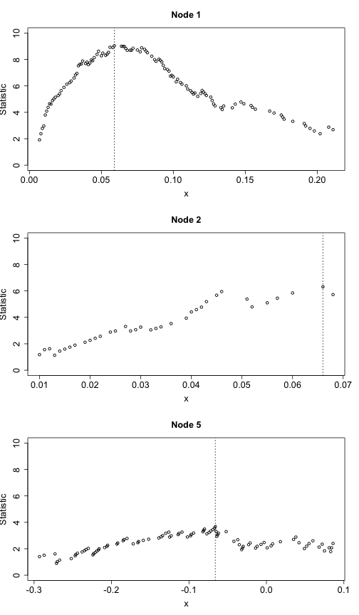

Discriminant Function Analysis 
========================================================
From: http://www.statmethods.net/advstats/discriminant.html

Linear Discriminant Analysis with Jacknifed Prediction
-------------------------------------------------------

```r
library(MASS)
mydata <- iris

fit <- lda(Species ~ Sepal.Length + Sepal.Width + Petal.Length, data = mydata, 
    na.action = "na.omit", CV = TRUE)
fit
```

```
## $class
##   [1] setosa     setosa     setosa     setosa     setosa     setosa    
##   [7] setosa     setosa     setosa     setosa     setosa     setosa    
##  [13] setosa     setosa     setosa     setosa     setosa     setosa    
##  [19] setosa     setosa     setosa     setosa     setosa     setosa    
##  [25] setosa     setosa     setosa     setosa     setosa     setosa    
##  [31] setosa     setosa     setosa     setosa     setosa     setosa    
##  [37] setosa     setosa     setosa     setosa     setosa     setosa    
##  [43] setosa     setosa     setosa     setosa     setosa     setosa    
##  [49] setosa     setosa     versicolor versicolor versicolor versicolor
##  [55] versicolor versicolor versicolor versicolor versicolor versicolor
##  [61] versicolor versicolor versicolor versicolor versicolor versicolor
##  [67] versicolor versicolor versicolor versicolor virginica  versicolor
##  [73] versicolor versicolor versicolor versicolor versicolor versicolor
##  [79] versicolor versicolor versicolor versicolor versicolor virginica 
##  [85] versicolor versicolor versicolor versicolor versicolor versicolor
##  [91] versicolor versicolor versicolor versicolor versicolor versicolor
##  [97] versicolor versicolor versicolor versicolor virginica  virginica 
## [103] virginica  virginica  virginica  virginica  virginica  virginica 
## [109] virginica  virginica  virginica  virginica  virginica  virginica 
## [115] virginica  virginica  virginica  virginica  virginica  virginica 
## [121] virginica  virginica  virginica  versicolor virginica  virginica 
## [127] versicolor virginica  virginica  virginica  virginica  virginica 
## [133] virginica  virginica  virginica  virginica  virginica  virginica 
## [139] versicolor virginica  virginica  versicolor virginica  virginica 
## [145] virginica  virginica  virginica  virginica  virginica  virginica 
## Levels: setosa versicolor virginica
## 
## $posterior
##        setosa versicolor virginica
## 1   1.000e+00  2.869e-18 1.023e-32
## 2   1.000e+00  4.746e-15 4.050e-29
## 3   1.000e+00  2.654e-16 1.936e-30
## 4   1.000e+00  4.377e-13 3.992e-26
## 5   1.000e+00  2.675e-18 1.553e-32
## 6   1.000e+00  7.256e-18 2.018e-31
## 7   1.000e+00  1.318e-15 4.643e-29
## 8   1.000e+00  3.571e-16 6.134e-30
## 9   1.000e+00  1.949e-12 1.452e-25
## 10  1.000e+00  2.302e-14 5.819e-28
## 11  1.000e+00  2.324e-19 6.249e-34
## 12  1.000e+00  3.794e-14 4.425e-27
## 13  1.000e+00  1.254e-14 1.679e-28
## 14  1.000e+00  5.571e-16 2.694e-30
## 15  1.000e+00  2.486e-27 8.127e-45
## 16  1.000e+00  1.052e-24 5.029e-40
## 17  1.000e+00  5.384e-23 1.096e-38
## 18  1.000e+00  2.869e-18 1.023e-32
## 19  1.000e+00  9.718e-19 6.397e-33
## 20  1.000e+00  1.741e-18 2.029e-32
## 21  1.000e+00  1.543e-15 3.814e-29
## 22  1.000e+00  5.243e-18 6.007e-32
## 23  1.000e+00  1.717e-21 5.579e-37
## 24  1.000e+00  7.917e-14 6.906e-27
## 25  1.000e+00  1.158e-10 2.406e-22
## 26  1.000e+00  3.679e-13 1.672e-26
## 27  1.000e+00  5.220e-15 2.581e-28
## 28  1.000e+00  1.662e-17 1.158e-31
## 29  1.000e+00  3.071e-18 6.673e-33
## 30  1.000e+00  8.035e-13 1.336e-25
## 31  1.000e+00  8.504e-13 9.079e-26
## 32  1.000e+00  6.468e-18 1.703e-32
## 33  1.000e+00  1.855e-20 1.384e-34
## 34  1.000e+00  7.728e-24 3.157e-39
## 35  1.000e+00  2.302e-14 5.819e-28
## 36  1.000e+00  7.832e-19 4.102e-34
## 37  1.000e+00  2.043e-21 2.508e-37
## 38  1.000e+00  7.442e-18 6.934e-32
## 39  1.000e+00  4.560e-14 1.238e-27
## 40  1.000e+00  1.325e-16 1.446e-30
## 41  1.000e+00  4.839e-19 8.651e-34
## 42  1.000e+00  6.468e-11 1.019e-24
## 43  1.000e+00  5.475e-15 1.550e-28
## 44  1.000e+00  1.847e-15 9.388e-29
## 45  1.000e+00  1.059e-13 8.398e-26
## 46  1.000e+00  1.254e-14 1.679e-28
## 47  1.000e+00  2.862e-17 1.020e-30
## 48  1.000e+00  1.066e-14 3.577e-28
## 49  1.000e+00  6.651e-19 2.931e-33
## 50  1.000e+00  6.889e-17 3.870e-31
## 51  2.724e-15  9.959e-01 4.096e-03
## 52  1.361e-15  9.934e-01 6.587e-03
## 53  1.065e-18  9.447e-01 5.531e-02
## 54  8.911e-18  9.986e-01 1.406e-03
## 55  3.111e-18  9.883e-01 1.170e-02
## 56  1.025e-20  8.645e-01 1.355e-01
## 57  5.393e-18  9.071e-01 9.287e-02
## 58  1.297e-11  1.000e+00 7.655e-06
## 59  2.618e-17  9.924e-01 7.602e-03
## 60  5.262e-16  9.980e-01 2.002e-03
## 61  2.561e-15  1.000e+00 4.631e-05
## 62  3.646e-15  9.977e-01 2.251e-03
## 63  5.459e-16  9.999e-01 1.301e-04
## 64  6.631e-21  8.182e-01 1.818e-01
## 65  5.135e-10  1.000e+00 9.628e-06
## 66  1.491e-13  9.995e-01 5.335e-04
## 67  2.877e-20  7.772e-01 2.228e-01
## 68  8.353e-16  9.989e-01 1.112e-03
## 69  2.136e-21  9.842e-01 1.578e-02
## 70  3.150e-15  9.997e-01 2.925e-04
## 71  3.529e-22  3.011e-01 6.989e-01
## 72  6.538e-13  9.999e-01 9.016e-05
## 73  6.589e-25  5.358e-01 4.642e-01
## 74  2.116e-21  8.212e-01 1.788e-01
## 75  1.245e-14  9.993e-01 6.718e-04
## 76  1.844e-14  9.992e-01 8.347e-04
## 77  2.275e-19  9.715e-01 2.851e-02
## 78  1.602e-21  7.034e-01 2.966e-01
## 79  8.749e-19  9.633e-01 3.674e-02
## 80  1.010e-09  1.000e+00 1.632e-06
## 81  6.226e-15  9.999e-01 1.483e-04
## 82  9.187e-14  1.000e+00 4.693e-05
## 83  1.720e-13  9.999e-01 1.179e-04
## 84  9.405e-30  2.352e-02 9.765e-01
## 85  1.910e-21  5.373e-01 4.627e-01
## 86  2.227e-16  9.533e-01 4.671e-02
## 87  3.973e-17  9.849e-01 1.508e-02
## 88  4.150e-19  9.968e-01 3.185e-03
## 89  2.939e-15  9.970e-01 3.029e-03
## 90  7.733e-17  9.986e-01 1.431e-03
## 91  2.213e-21  8.852e-01 1.148e-01
## 92  4.237e-19  9.304e-01 6.957e-02
## 93  4.335e-15  9.996e-01 3.592e-04
## 94  1.228e-11  1.000e+00 4.572e-06
## 95  7.334e-18  9.915e-01 8.481e-03
## 96  5.200e-16  9.943e-01 5.744e-03
## 97  1.756e-16  9.944e-01 5.568e-03
## 98  1.660e-15  9.983e-01 1.678e-03
## 99  7.836e-07  1.000e+00 5.981e-08
## 100 8.994e-16  9.982e-01 1.797e-03
## 101 2.143e-39  4.567e-06 1.000e+00
## 102 1.945e-29  1.532e-02 9.847e-01
## 103 3.274e-33  7.953e-04 9.992e-01
## 104 9.002e-34  5.601e-04 9.994e-01
## 105 1.735e-35  1.471e-04 9.999e-01
## 106 4.023e-43  2.372e-06 1.000e+00
## 107 6.436e-26  2.318e-01 7.682e-01
## 108 9.173e-40  2.104e-05 1.000e+00
## 109 1.137e-36  4.144e-04 9.996e-01
## 110 3.514e-33  1.193e-04 9.999e-01
## 111 3.174e-23  2.629e-01 7.371e-01
## 112 5.307e-29  2.491e-02 9.751e-01
## 113 1.928e-28  1.641e-02 9.836e-01
## 114 2.599e-29  3.077e-02 9.692e-01
## 115 5.557e-29  1.515e-02 9.849e-01
## 116 8.545e-27  2.340e-02 9.766e-01
## 117 2.621e-30  4.159e-03 9.958e-01
## 118 4.369e-40  9.158e-07 1.000e+00
## 119 1.785e-52  6.187e-08 1.000e+00
## 120 8.961e-29  1.292e-01 8.708e-01
## 121 3.519e-30  2.805e-03 9.972e-01
## 122 6.055e-27  5.632e-02 9.437e-01
## 123 6.394e-46  1.051e-06 1.000e+00
## 124 1.252e-23  5.905e-01 4.095e-01
## 125 5.504e-31  1.105e-03 9.989e-01
## 126 2.468e-33  3.991e-04 9.996e-01
## 127 1.778e-22  7.317e-01 2.683e-01
## 128 2.212e-23  3.480e-01 6.520e-01
## 129 1.394e-33  9.033e-04 9.991e-01
## 130 7.635e-31  3.929e-03 9.961e-01
## 131 8.351e-36  3.577e-04 9.996e-01
## 132 8.008e-33  1.019e-04 9.999e-01
## 133 1.394e-33  9.033e-04 9.991e-01
## 134 4.919e-26  1.256e-01 8.744e-01
## 135 1.135e-36  2.311e-04 9.998e-01
## 136 9.627e-33  1.495e-03 9.985e-01
## 137 2.163e-31  5.298e-04 9.995e-01
## 138 1.777e-30  2.620e-03 9.974e-01
## 139 1.535e-22  5.151e-01 4.849e-01
## 140 8.165e-26  7.496e-02 9.250e-01
## 141 3.022e-30  3.406e-03 9.966e-01
## 142 1.282e-21  7.277e-01 2.723e-01
## 143 1.945e-29  1.532e-02 9.847e-01
## 144 3.001e-34  1.884e-04 9.998e-01
## 145 5.504e-31  1.105e-03 9.989e-01
## 146 2.101e-24  2.308e-01 7.692e-01
## 147 9.045e-26  3.379e-01 6.621e-01
## 148 1.495e-25  1.032e-01 8.968e-01
## 149 1.207e-28  3.254e-03 9.967e-01
## 150 1.802e-27  2.319e-02 9.768e-01
## 
## $terms
## Species ~ Sepal.Length + Sepal.Width + Petal.Length
## attr(,"variables")
## list(Species, Sepal.Length, Sepal.Width, Petal.Length)
## attr(,"factors")
##              Sepal.Length Sepal.Width Petal.Length
## Species                 0           0            0
## Sepal.Length            1           0            0
## Sepal.Width             0           1            0
## Petal.Length            0           0            1
## attr(,"term.labels")
## [1] "Sepal.Length" "Sepal.Width"  "Petal.Length"
## attr(,"order")
## [1] 1 1 1
## attr(,"intercept")
## [1] 1
## attr(,"response")
## [1] 1
## attr(,".Environment")
## <environment: R_GlobalEnv>
## attr(,"predvars")
## list(Species, Sepal.Length, Sepal.Width, Petal.Length)
## attr(,"dataClasses")
##      Species Sepal.Length  Sepal.Width Petal.Length 
##     "factor"    "numeric"    "numeric"    "numeric" 
## 
## $call
## lda(formula = Species ~ Sepal.Length + Sepal.Width + Petal.Length, 
##     data = mydata, CV = TRUE, na.action = "na.omit")
## 
## $xlevels
## named list()
```

Assess the accuracy of the prediction percent correct for each category of G


```r
ct <- table(mydata$Species, fit$class)
diag(prop.table(ct, 1))
```

```
##     setosa versicolor  virginica 
##       1.00       0.96       0.92
```

total percent correct

```r
sum(diag(prop.table(ct)))
```

```
## [1] 0.96
```


** To Do: do a MANOVA for significance test. ** 

Quadratic Discriminant Function
-------------------------------

Quadratic Discriminant Analysis with 3 groups applying resubstitution prediction and equal prior probabilities.

```r
fit2 <- qda(Species ~ Sepal.Length + Sepal.Width + Petal.Length, data = na.omit(mydata), 
    prior = c(1, 1, 1)/3)
fit2
```

```
## Call:
## qda(Species ~ Sepal.Length + Sepal.Width + Petal.Length, data = na.omit(mydata), 
##     prior = c(1, 1, 1)/3)
## 
## Prior probabilities of groups:
##     setosa versicolor  virginica 
##     0.3333     0.3333     0.3333 
## 
## Group means:
##            Sepal.Length Sepal.Width Petal.Length
## setosa            5.006       3.428        1.462
## versicolor        5.936       2.770        4.260
## virginica         6.588       2.974        5.552
```

```r
ct2 <- table(mydata$Species, predict(fit2, mydata)$class)
diag(prop.table(ct2, 1))
```

```
##     setosa versicolor  virginica 
##       1.00       0.92       0.92
```

```r
# total percent correct
sum(diag(prop.table(ct2)))
```

```
## [1] 0.9467
```


Visualizing the Results
-----------------------
Scatter plot using the 1st two discriminant dimensions


```r
plot(fit2)  # fit from lda ??? did not work
```

```
## Error: 'x' is a list, but does not have components 'x' and 'y'
```

```r
# Panels of histograms and overlayed density plots for 1st discriminant
# function
plot(fit2, dimen = 1, type = "both")  # fit from lda #does not work with the plot function!!!
```

```
## Error: 'x' is a list, but does not have components 'x' and 'y'
```


The partimat( ) function in the klaR package can display the results of a linear or quadratic classifications 2 variables at a time.

Exploratory Graph for LDA or QDA

```r
library(klaR)
```

```
## Warning: package 'klaR' was built under R version 3.0.2
```

```r
partimat(Species ~ Sepal.Length + Sepal.Width + Petal.Length, data = mydata, 
    method = "lda")
```

  


You can also produce a scatterplot matrix with color coding by group.

Scatterplot for 3 Group Problem

```r
pairs(mydata[c("Sepal.Length", "Sepal.Width", "Petal.Length")], main = "Iris data", 
    pch = 22, bg = c("red", "yellow", "blue")[unclass(mydata$Species)])
```

 

