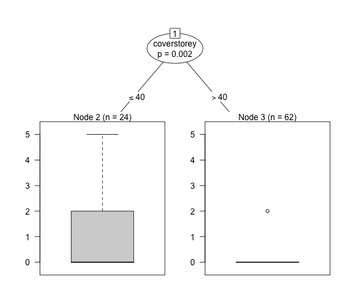
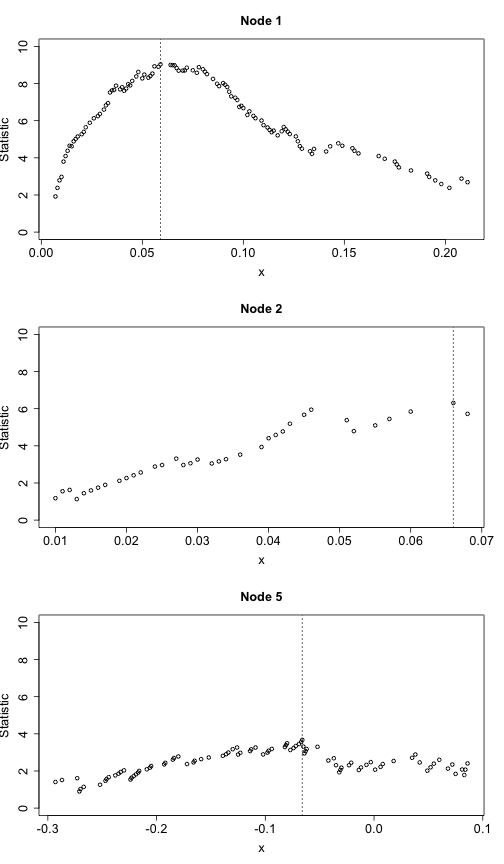

party: A Laboratory for Recursive Partytioning
========================================================
This is to further understand the the ctree functionality. 
I am following the party package manual.
These are some of the examples in there.

```r
rm(list = ls())
library(party)
```

```
## Warning: package 'party' was built under R version 3.0.2
```

```
## Loading required package: grid
## Loading required package: zoo
## 
## Attaching package: 'zoo'
## 
## The following object is masked from 'package:base':
## 
##     as.Date, as.Date.numeric
## 
## Loading required package: sandwich
## Loading required package: strucchange
```

```
## Warning: package 'strucchange' was built under R version 3.0.2
```

```
## Loading required package: modeltools
## Loading required package: stats4
```

```r
library(psych)
data("treepipit", package = "coin")
str(treepipit)
```

```
## 'data.frame':	86 obs. of  10 variables:
##  $ counts     : int  0 0 0 0 0 2 0 0 0 0 ...
##  $ age        : int  120 120 120 120 120 200 200 200 120 200 ...
##  $ coverstorey: int  80 70 90 90 90 80 70 75 90 55 ...
##  $ coverregen : int  60 90 70 20 20 80 90 60 20 100 ...
##  $ meanregen  : num  7 3 6 7 4 5 5 5 4 9 ...
##  $ coniferous : int  20 25 40 5 1 0 0 0 0 1 ...
##  $ deadtree   : int  0 1 0 0 0 1 0 0 0 0 ...
##  $ cbpiles    : int  4 2 7 11 11 3 1 2 9 2 ...
##  $ ivytree    : int  0 0 0 0 0 0 0 0 9 0 ...
##  $ fdist      : int  100 10 110 10 110 30 40 60 20 60 ...
```

```r
describeBy(treepipit, treepipit$Count)
```

```
## Warning: no grouping variable requested
```

```
##             var  n   mean     sd median trimmed    mad min max range  skew
## counts        1 86   0.31   0.97    0.0    0.03   0.00   0   5     5  3.21
## age           2 86 183.49  33.95  200.0  185.43  44.48 120 230   110 -0.46
## coverstorey   3 86  68.37  33.18   75.0   70.43  37.06   3 110   107 -0.47
## coverregen    4 86  40.12  36.67   30.0   37.86  44.48   0 100   100  0.39
## meanregen     5 86   2.96   2.94    2.0    2.67   2.97   0  10    10  0.71
## coniferous    6 86   6.37  12.63    0.0    3.54   0.00   0  60    60  2.06
## deadtree      7 86   0.38   0.67    0.0    0.24   0.00   0   3     3  1.69
## cbpiles       8 86   2.55   2.76    2.0    2.09   2.97   0  11    11  1.35
## ivytree       9 86   0.60   1.79    0.0    0.17   0.00   0  12    12  4.40
## fdist        10 86 162.50 130.42  127.5  145.07 107.49  10 500   490  1.08
##             kurtosis    se
## counts          9.71  0.10
## age            -0.77  3.66
## coverstorey    -1.05  3.58
## coverregen     -1.39  3.95
## meanregen      -0.80  0.32
## coniferous      3.63  1.36
## deadtree        2.24  0.07
## cbpiles         1.25  0.30
## ivytree        22.05  0.19
## fdist           0.39 14.06
```

```r
ct <- ctree(counts ~ ., data = treepipit)
```


```r
plot(ct)
```

 

```r
plot(ct, terminal_panel = node_hist(ct, breaks = 0:6 - 0.5, ymax = 65, horizontal = FALSE, 
    freq = TRUE))
```

 


#### Trying a Linear Model to confirm varible significance.


```r
lm.model <- lm(formula = counts ~ ., data = treepipit)
summary(lm.model)
```

```
## 
## Call:
## lm(formula = counts ~ ., data = treepipit)
## 
## Residuals:
##    Min     1Q Median     3Q    Max 
## -1.559 -0.361 -0.110  0.179  3.920 
## 
## Coefficients:
##              Estimate Std. Error t value Pr(>|t|)   
## (Intercept)  1.290124   0.870667    1.48   0.1425   
## age         -0.001750   0.003480   -0.50   0.6165   
## coverstorey -0.011871   0.004464   -2.66   0.0095 **
## coverregen   0.000164   0.004573    0.04   0.9715   
## meanregen   -0.065815   0.051957   -1.27   0.2091   
## coniferous  -0.014183   0.008527   -1.66   0.1004   
## deadtree    -0.011832   0.148647   -0.08   0.9368   
## cbpiles      0.067433   0.039550    1.71   0.0923 . 
## ivytree     -0.031706   0.054021   -0.59   0.5590   
## fdist        0.001768   0.000849    2.08   0.0407 * 
## ---
## Signif. codes:  0 '***' 0.001 '**' 0.01 '*' 0.05 '.' 0.1 ' ' 1
## 
## Residual standard error: 0.852 on 76 degrees of freedom
## Multiple R-squared:  0.316,	Adjusted R-squared:  0.235 
## F-statistic: 3.89 on 9 and 76 DF,  p-value: 0.000424
```


Glucoma and laser scanning images
==================================

```r
data("GlaucomaM", package = "TH.data")
# describeBy(GlaucomaM,group=GlaucomaM$Class)
describe(GlaucomaM)
```

```
##        var   n  mean   sd median trimmed  mad   min  max range  skew
## ag       1 196  2.61 0.66   2.53    2.56 0.60  1.31 5.44  4.13  0.90
## at       2 196  0.46 0.13   0.44    0.45 0.11  0.20 0.97  0.77  0.88
## as       3 196  0.65 0.16   0.63    0.64 0.15  0.34 1.34  1.00  0.88
## an       4 196  0.84 0.22   0.81    0.82 0.20  0.40 1.76  1.37  0.91
## ai       5 196  0.66 0.16   0.63    0.65 0.15  0.37 1.37  1.00  0.90
## eag      6 196  1.87 0.72   1.84    1.85 0.73  0.42 4.12  3.71  0.38
## eat      7 196  0.41 0.13   0.40    0.40 0.12  0.14 0.85  0.71  0.35
## eas      8 196  0.49 0.18   0.47    0.48 0.16  0.02 1.23  1.21  0.40
## ean      9 196  0.50 0.29   0.50    0.49 0.29  0.01 1.57  1.56  0.47
## eai     10 196  0.48 0.17   0.48    0.48 0.17  0.10 0.96  0.86  0.09
## abrg    11 196  1.29 0.78   1.31    1.25 0.72  0.00 4.98  4.98  0.88
## abrt    12 196  0.32 0.14   0.32    0.32 0.15  0.00 0.83  0.82  0.13
## abrs    13 196  0.33 0.20   0.32    0.32 0.19  0.00 1.34  1.34  0.85
## abrn    14 196  0.31 0.28   0.25    0.28 0.27  0.00 1.76  1.76  1.46
## abri    15 196  0.33 0.20   0.33    0.32 0.21  0.00 1.21  1.21  0.53
## hic     16 196  0.31 0.18   0.32    0.31 0.16 -0.19 0.89  1.08 -0.07
## mhcg    17 196  0.09 0.07   0.09    0.09 0.07 -0.15 0.32  0.47  0.04
## mhct    18 196  0.21 0.10   0.21    0.21 0.09 -0.05 0.48  0.52  0.04
## mhcs    19 196  0.06 0.08   0.07    0.06 0.08 -0.17 0.29  0.46 -0.09
## mhcn    20 196  0.07 0.09   0.08    0.07 0.08 -0.21 0.66  0.87  1.21
## mhci    21 196  0.06 0.09   0.06    0.06 0.10 -0.16 0.45  0.62  0.28
## phcg    22 196 -0.08 0.08  -0.09   -0.08 0.08 -0.29 0.14  0.43  0.05
## phct    23 196  0.15 0.09   0.15    0.15 0.08 -0.12 0.43  0.55 -0.16
## phcs    24 196 -0.03 0.08  -0.03   -0.03 0.08 -0.25 0.16  0.41 -0.11
## phcn    25 196 -0.03 0.09  -0.03   -0.03 0.08 -0.28 0.40  0.68  0.47
## phci    26 196 -0.04 0.10  -0.05   -0.04 0.10 -0.29 0.37  0.66  0.45
## hvc     27 196  0.36 0.12   0.35    0.35 0.11  0.11 0.97  0.86  0.89
## vbsg    28 196  0.63 0.41   0.60    0.60 0.39  0.02 2.13  2.11  0.90
## vbst    29 196  0.13 0.08   0.12    0.13 0.07  0.01 0.45  0.44  0.99
## vbss    30 196  0.19 0.12   0.17    0.17 0.12  0.00 0.82  0.82  1.17
## vbsn    31 196  0.15 0.13   0.12    0.13 0.12  0.00 0.70  0.70  1.25
## vbsi    32 196  0.16 0.10   0.16    0.16 0.11  0.01 0.49  0.48  0.65
## vasg    33 196  0.05 0.06   0.04    0.04 0.03  0.01 0.75  0.74  8.06
## vast    34 196  0.00 0.00   0.00    0.00 0.00  0.00 0.03  0.03  3.80
## vass    35 196  0.01 0.02   0.01    0.01 0.00  0.00 0.24  0.24 10.38
## vasn    36 196  0.03 0.03   0.02    0.02 0.01  0.00 0.40  0.40  7.39
## vasi    37 196  0.01 0.01   0.01    0.01 0.01  0.00 0.10  0.10  2.97
## vbrg    38 196  0.43 0.42   0.35    0.37 0.31  0.00 3.70  3.70  3.07
## vbrt    39 196  0.10 0.08   0.08    0.09 0.07  0.00 0.40  0.40  1.27
## vbrs    40 196  0.12 0.12   0.10    0.11 0.09  0.00 1.10  1.10  3.11
## vbrn    41 196  0.10 0.15   0.06    0.08 0.08  0.00 1.62  1.62  5.96
## vbri    42 196  0.11 0.09   0.09    0.09 0.09  0.00 0.59  0.59  1.46
## varg    43 196  0.30 0.20   0.28    0.27 0.18  0.02 1.32  1.31  1.30
## vart    44 196  0.01 0.01   0.01    0.01 0.01  0.00 0.06  0.06  2.12
## vars    45 196  0.08 0.06   0.07    0.07 0.05  0.00 0.40  0.40  1.70
## varn    46 196  0.13 0.09   0.12    0.12 0.09  0.00 0.60  0.60  1.21
## vari    47 196  0.08 0.06   0.07    0.07 0.05  0.00 0.27  0.26  0.93
## mdg     48 196  0.69 0.20   0.68    0.69 0.17  0.12 1.30  1.18  0.05
## mdt     49 196  0.61 0.19   0.60    0.61 0.17  0.12 1.22  1.10  0.23
## mds     50 196  0.70 0.23   0.69    0.69 0.18  0.02 1.35  1.33  0.14
## mdn     51 196  0.61 0.25   0.63    0.62 0.24  0.02 1.26  1.24 -0.36
## mdi     52 196  0.64 0.20   0.64    0.64 0.16  0.12 1.25  1.13  0.00
## tmg     53 196 -0.09 0.11  -0.08   -0.09 0.11 -0.35 0.19  0.54 -0.02
## tmt     54 196  0.00 0.13  -0.02   -0.01 0.13 -0.29 0.37  0.66  0.33
## tms     55 196 -0.04 0.15  -0.03   -0.04 0.15 -0.45 0.36  0.81 -0.22
## tmn     56 196 -0.15 0.13  -0.15   -0.15 0.13 -0.51 0.24  0.76  0.00
## tmi     57 196 -0.04 0.14  -0.04   -0.04 0.13 -0.40 0.42  0.82  0.10
## mr      58 196  0.90 0.11   0.90    0.90 0.11  0.65 1.32  0.67  0.50
## rnf     59 196  0.18 0.09   0.18    0.18 0.09 -0.30 0.45  0.75 -0.36
## mdic    60 196  0.23 0.12   0.23    0.23 0.12  0.01 0.66  0.65  0.57
## emd     61 196  0.31 0.13   0.30    0.30 0.12  0.05 0.74  0.70  0.56
## mv      62 196  0.03 0.02   0.03    0.03 0.01  0.00 0.18  0.18  3.01
## Class*  63 196  1.50 0.50   1.50    1.50 0.74  1.00 2.00  1.00  0.00
##        kurtosis   se
## ag         1.42 0.05
## at         1.39 0.01
## as         1.41 0.01
## an         1.45 0.02
## ai         1.48 0.01
## eag        0.14 0.05
## eat        0.16 0.01
## eas        1.10 0.01
## ean        0.31 0.02
## eai       -0.36 0.01
## abrg       2.12 0.06
## abrt       0.33 0.01
## abrs       2.43 0.01
## abrn       3.45 0.02
## abri       1.01 0.01
## hic        0.28 0.01
## mhcg       0.86 0.00
## mhct       0.18 0.01
## mhcs      -0.09 0.01
## mhcn       7.99 0.01
## mhci       0.86 0.01
## phcg      -0.35 0.01
## phct       0.60 0.01
## phcs      -0.29 0.01
## phcn       2.25 0.01
## phci       0.84 0.01
## hvc        2.60 0.01
## vbsg       0.97 0.03
## vbst       1.17 0.01
## vbss       2.72 0.01
## vbsn       2.09 0.01
## vbsi       0.18 0.01
## vasg      87.89 0.00
## vast      21.16 0.00
## vass     126.48 0.00
## vasn      76.84 0.00
## vasi      13.48 0.00
## vbrg      18.39 0.03
## vbrt       1.82 0.01
## vbrs      19.32 0.01
## vbrn      53.98 0.01
## vbri       3.30 0.01
## varg       3.03 0.01
## vart       5.88 0.00
## vars       5.14 0.00
## varn       3.05 0.01
## vari       0.43 0.00
## mdg        0.56 0.01
## mdt        0.54 0.01
## mds        0.77 0.02
## mdn       -0.16 0.02
## mdi        0.57 0.01
## tmg       -0.27 0.01
## tmt       -0.22 0.01
## tms       -0.22 0.01
## tmn        0.08 0.01
## tmi        0.13 0.01
## mr         0.44 0.01
## rnf        2.69 0.01
## mdic       0.45 0.01
## emd        0.63 0.01
## mv        13.67 0.00
## Class*    -2.01 0.04
```

```r
str(GlaucomaM)
```

```
## 'data.frame':	196 obs. of  63 variables:
##  $ ag   : num  2.22 2.68 1.98 1.75 2.99 ...
##  $ at   : num  0.354 0.475 0.343 0.269 0.599 0.483 0.355 0.312 0.365 0.53 ...
##  $ as   : num  0.58 0.672 0.508 0.476 0.686 0.763 0.601 0.463 0.57 0.834 ...
##  $ an   : num  0.686 0.868 0.624 0.525 1.039 ...
##  $ ai   : num  0.601 0.667 0.504 0.476 0.667 0.77 0.586 0.483 0.572 0.814 ...
##  $ eag  : num  1.267 2.053 1.2 0.612 2.513 ...
##  $ eat  : num  0.336 0.44 0.299 0.147 0.543 0.462 0.298 0.226 0.253 0.472 ...
##  $ eas  : num  0.346 0.52 0.396 0.017 0.607 0.637 0.243 0.247 0.353 0.534 ...
##  $ ean  : num  0.255 0.639 0.259 0.044 0.871 0.504 0.153 0.023 0.038 0.517 ...
##  $ eai  : num  0.331 0.454 0.246 0.405 0.492 0.597 0.387 0.192 0.221 0.576 ...
##  $ abrg : num  0.479 1.09 0.465 0.17 1.8 ...
##  $ abrt : num  0.26 0.377 0.209 0.062 0.431 0.394 0.188 0.126 0.073 0.162 ...
##  $ abrs : num  0.107 0.257 0.112 0 0.494 0.365 0.102 0.048 0.033 0.163 ...
##  $ abrn : num  0.014 0.212 0.041 0 0.601 0.251 0.033 0 0 0.197 ...
##  $ abri : num  0.098 0.245 0.103 0.108 0.274 0.301 0.159 0.04 0.034 0.186 ...
##  $ hic  : num  0.214 0.382 0.195 -0.03 0.383 0.442 0.18 -0.023 -0.005 0.181 ...
##  $ mhcg : num  0.111 0.14 0.062 -0.015 0.089 0.128 0.097 -0.042 -0.002 0.037 ...
##  $ mhct : num  0.412 0.338 0.356 0.074 0.233 0.375 0.329 0.168 0.197 0.283 ...
##  $ mhcs : num  0.036 0.104 0.045 -0.084 0.145 0.049 0.037 -0.073 -0.004 -0.035 ...
##  $ mhcn : num  0.105 0.08 -0.009 -0.05 0.023 0.111 0.019 -0.109 -0.038 0.019 ...
##  $ mhci : num  -0.022 0.109 -0.048 0.035 0.007 0.052 0.093 -0.077 -0.098 -0.049 ...
##  $ phcg : num  -0.139 -0.015 -0.149 -0.182 -0.131 -0.088 -0.125 -0.183 -0.22 -0.15 ...
##  $ phct : num  0.242 0.296 0.206 -0.097 0.163 0.281 0.238 0.084 0.103 0.227 ...
##  $ phcs : num  -0.053 -0.015 -0.092 -0.125 0.055 -0.067 -0.029 -0.183 -0.088 -0.107 ...
##  $ phcn : num  0.01 -0.015 -0.081 -0.138 -0.131 -0.062 -0.125 -0.151 -0.214 -0.1 ...
##  $ phci : num  -0.139 0.036 -0.149 -0.182 -0.115 -0.088 -0.121 -0.138 -0.22 -0.15 ...
##  $ hvc  : num  0.613 0.382 0.557 0.373 0.405 0.507 0.486 0.394 0.484 0.455 ...
##  $ vbsg : num  0.303 0.676 0.3 0.048 0.889 0.972 0.252 0.107 0.116 0.497 ...
##  $ vbst : num  0.103 0.181 0.084 0.011 0.151 0.213 0.073 0.043 0.042 0.083 ...
##  $ vbss : num  0.088 0.186 0.088 0 0.253 0.316 0.058 0.038 0.042 0.122 ...
##  $ vbsn : num  0.022 0.141 0.046 0 0.33 0.197 0.024 0.001 0.002 0.138 ...
##  $ vbsi : num  0.09 0.169 0.082 0.036 0.155 0.246 0.096 0.026 0.03 0.155 ...
##  $ vasg : num  0.062 0.029 0.036 0.07 0.02 0.043 0.057 0.072 0.116 0.037 ...
##  $ vast : num  0 0.001 0.002 0.005 0.001 0.001 0.002 0.003 0.004 0.001 ...
##  $ vass : num  0.011 0.007 0.004 0.03 0.004 0.005 0.016 0.011 0.014 0.009 ...
##  $ vasn : num  0.032 0.011 0.016 0.033 0.008 0.028 0.03 0.045 0.075 0.02 ...
##  $ vasi : num  0.018 0.01 0.013 0.002 0.007 0.009 0.01 0.012 0.023 0.007 ...
##  $ vbrg : num  0.075 0.37 0.081 0.005 0.532 0.467 0.085 0.032 0.012 0.146 ...
##  $ vbrt : num  0.039 0.127 0.034 0.001 0.103 0.136 0.03 0.017 0.005 0.03 ...
##  $ vbrs : num  0.021 0.099 0.019 0 0.173 0.148 0.018 0.011 0.002 0.029 ...
##  $ vbrn : num  0.002 0.05 0.007 0 0.181 0.078 0.006 0 0 0.04 ...
##  $ vbri : num  0.014 0.093 0.021 0.004 0.075 0.104 0.031 0.004 0.005 0.047 ...
##  $ varg : num  0.756 0.41 0.565 0.38 0.228 0.54 0.587 0.479 0.704 0.696 ...
##  $ vart : num  0.009 0.006 0.014 0.032 0.011 0.008 0.013 0.015 0.035 0.029 ...
##  $ vars : num  0.209 0.105 0.132 0.147 0.026 0.133 0.185 0.115 0.154 0.219 ...
##  $ varn : num  0.298 0.181 0.243 0.151 0.105 0.232 0.263 0.223 0.302 0.246 ...
##  $ vari : num  0.24 0.117 0.177 0.05 0.087 0.167 0.126 0.127 0.214 0.202 ...
##  $ mdg  : num  0.705 0.898 0.687 0.207 0.721 0.927 0.573 0.559 0.476 0.648 ...
##  $ mdt  : num  0.637 0.85 0.643 0.171 0.638 0.842 0.525 0.444 0.439 0.577 ...
##  $ mds  : num  0.738 0.907 0.689 0.022 0.73 0.953 0.58 0.672 0.403 0.627 ...
##  $ mdn  : num  0.596 0.771 0.684 0.046 0.73 0.906 0.581 0.124 0.217 0.62 ...
##  $ mdi  : num  0.691 0.94 0.7 0.221 0.64 0.898 0.575 0.411 0.581 0.666 ...
##  $ tmg  : num  -0.236 -0.211 -0.185 -0.148 -0.052 -0.04 -0.149 -0.298 -0.278 -0.19 ...
##  $ tmt  : num  -0.018 -0.014 -0.097 -0.035 -0.105 0.087 -0.036 -0.14 -0.144 -0.288 ...
##  $ tms  : num  -0.23 -0.165 -0.235 -0.449 0.084 0.018 -0.18 -0.378 -0.273 -0.193 ...
##  $ tmn  : num  -0.51 -0.317 -0.337 -0.217 -0.012 -0.094 -0.394 -0.457 -0.194 -0.084 ...
##  $ tmi  : num  -0.158 -0.192 -0.02 -0.091 -0.054 -0.051 -0.07 -0.25 -0.371 -0.096 ...
##  $ mr   : num  0.841 0.924 0.795 0.746 0.977 ...
##  $ rnf  : num  0.41 0.256 0.378 0.2 0.193 0.339 0.308 0.263 0.316 0.319 ...
##  $ mdic : num  0.137 0.252 0.152 0.027 0.297 0.333 0.113 0.058 0.053 0.158 ...
##  $ emd  : num  0.239 0.329 0.25 0.078 0.354 0.442 0.233 0.155 0.134 0.237 ...
##  $ mv   : num  0.035 0.022 0.029 0.023 0.034 0.028 0.012 0.023 0.029 0.022 ...
##  $ Class: Factor w/ 2 levels "glaucoma","normal": 2 2 2 2 2 2 2 2 2 2 ...
```

```r
gt <- ctree(Class ~ ., data = GlaucomaM, controls = ctree_control(minsplit = 50))
plot(gt)
```

 


#### Linear Model for the same

```r
data.GlaucomaM <- GlaucomaM
data.GlaucomaM$Class <- as.numeric(data.GlaucomaM$Class)
# g.lm <- lm(formula=Class ~ ., data=data.GlaucomaM)
g.lm2 <- lm(formula = Class ~ vari * vasg * tms, data = data.GlaucomaM)
# summary(g.lm)
summary(g.lm2)
```

```
## 
## Call:
## lm(formula = Class ~ vari * vasg * tms, data = data.GlaucomaM)
## 
## Residuals:
##     Min      1Q  Median      3Q     Max 
## -0.9502 -0.2467  0.0047  0.2860  0.9495 
## 
## Coefficients:
##                Estimate Std. Error t value Pr(>|t|)    
## (Intercept)      0.8428     0.0859    9.81  < 2e-16 ***
## vari             8.9746     1.2535    7.16  1.8e-11 ***
## vasg             6.1939     1.9456    3.18  0.00170 ** 
## tms             -0.8284     0.4541   -1.82  0.06968 .  
## vari:vasg      -83.7014    21.8032   -3.84  0.00017 ***
## vari:tms        16.8281     4.6235    3.64  0.00035 ***
## vasg:tms       -12.1041    11.1347   -1.09  0.27841    
## vari:vasg:tms -158.8602    71.7008   -2.22  0.02792 *  
## ---
## Signif. codes:  0 '***' 0.001 '**' 0.01 '*' 0.05 '.' 0.1 ' ' 1
## 
## Residual standard error: 0.366 on 188 degrees of freedom
## Multiple R-squared:  0.486,	Adjusted R-squared:  0.467 
## F-statistic: 25.4 on 7 and 188 DF,  p-value: <2e-16
```

**Dropping** _tms_

```r
g.lm3 <- lm(formula = Class ~ vari * vasg, data = data.GlaucomaM)
# summary(g.lm)
summary(g.lm3)
```

```
## 
## Call:
## lm(formula = Class ~ vari * vasg, data = data.GlaucomaM)
## 
## Residuals:
##     Min      1Q  Median      3Q     Max 
## -1.1629 -0.2496 -0.0698  0.3314  0.7756 
## 
## Coefficients:
##             Estimate Std. Error t value Pr(>|t|)    
## (Intercept)   0.9232     0.0658   14.04  < 2e-16 ***
## vari          5.9071     0.5661   10.43  < 2e-16 ***
## vasg          4.4824     1.4193    3.16  0.00184 ** 
## vari:vasg   -20.9550     5.8591   -3.58  0.00044 ***
## ---
## Signif. codes:  0 '***' 0.001 '**' 0.01 '*' 0.05 '.' 0.1 ' ' 1
## 
## Residual standard error: 0.389 on 192 degrees of freedom
## Multiple R-squared:  0.407,	Adjusted R-squared:  0.397 
## F-statistic: 43.9 on 3 and 192 DF,  p-value: <2e-16
```


**Looking at split statitics(verbatim from the text)**

```r
cex <- 1.6
inner <- nodes(gt, c(1, 2, 5))
layout(matrix(1:length(inner), nrow = length(inner)))
out <- sapply(inner, function(i) {
    splitstat <- i$psplit$splitstatistic
    x <- data.GlaucomaM[[i$psplit$variableName]][splitstat > 0]
    plot(x, splitstat[splitstat > 0], main = paste("Node", i$nodeID), xlab = i$psplit$varibleName, 
        ylab = "Statistic", ylim = c(0, 10), cex.axis = cex, cex.lab = cex, 
        cex.main = cex)
    abline(v = i$psplit$splitpoint, lty = 3)
})
```

 


**Estimated conditional class probabilities**

```r
prob <- sapply(treeresponse(gt), function(x) x[1]) + runif(nrow(data.GlaucomaM), 
    min = -0.01, max = 0.01)
splitvar <- nodes(gt, 1)[[1]]$psplit$variableName
plot(data.GlaucomaM[[splitvar]], prob, pch = as.numeric(data.GlaucomaM$Class), 
    col = as.numeric(data.GlaucomaM$Class), ylab = "Conditional Class Prob.", 
    xlab = splitvar)
abline(v = nodes(gt, 1)[[1]]$psplit$splitpoint, lty = 2)
legend(0.15, 0.7, pch = 1:2, col = 1:2, legend = levels(GlaucomaM$Class), bty = "n")
```

 


**Predictions for the learning class;**

```r
table(Predict(gt), GlaucomaM$Class)
```

```
##           
##            glaucoma normal
##   glaucoma       74      5
##   normal         24     93
```


Node positive breast cancer
===========================


```r
data("GBSG2", package = "TH.data")
str(GBSG2)
```

```
## 'data.frame':	686 obs. of  10 variables:
##  $ horTh   : Factor w/ 2 levels "no","yes": 1 2 2 2 1 1 2 1 1 1 ...
##  $ age     : int  70 56 58 59 73 32 59 65 80 66 ...
##  $ menostat: Factor w/ 2 levels "Pre","Post": 2 2 2 2 2 1 2 2 2 2 ...
##  $ tsize   : int  21 12 35 17 35 57 8 16 39 18 ...
##  $ tgrade  : Ord.factor w/ 3 levels "I"<"II"<"III": 2 2 2 2 2 3 2 2 2 2 ...
##  $ pnodes  : int  3 7 9 4 1 24 2 1 30 7 ...
##  $ progrec : int  48 61 52 60 26 0 181 192 0 0 ...
##  $ estrec  : int  66 77 271 29 65 13 0 25 59 3 ...
##  $ time    : int  1814 2018 712 1807 772 448 2172 2161 471 2014 ...
##  $ cens    : int  1 1 1 1 1 1 0 0 1 0 ...
```

```r
help(GBSG2)
```

```
## No documentation for 'GBSG2' in specified packages and libraries:
## you could try '??GBSG2'
```

```r

describeBy(GBSG2, group = list(GBSG2$tgrade, GBSG2$menostat))
```

```
## : I
## : Pre
##           var  n    mean     sd median trimmed    mad min  max range  skew
## horTh*      1 33    1.24   0.44      1    1.19   0.00   1    2     1  1.15
## age         2 33   45.79   4.53     47   46.11   4.45  37   52    15 -0.62
## menostat*   3 33    1.00   0.00      1    1.00   0.00   1    1     0   NaN
## tsize       4 33   25.76  11.71     24   24.63   8.90   9   60    51  0.89
## tgrade*     5 33    1.00   0.00      1    1.00   0.00   1    1     0   NaN
## pnodes      6 33    3.09   2.73      2    2.56   1.48   1   11    10  1.56
## progrec     7 33  155.12 119.86    132  142.63 112.68  10  437   427  0.89
## estrec      8 33   60.39  56.47     44   50.04  32.62   0  214   214  1.51
## time        9 33 1464.36 655.03   1499 1500.48 719.06   8 2556  2548 -0.41
## cens       10 33    0.18   0.39      0    0.11   0.00   0    1     1  1.58
##           kurtosis     se
## horTh*       -0.70   0.08
## age          -0.94   0.79
## menostat*      NaN   0.00
## tsize         0.63   2.04
## tgrade*        NaN   0.00
## pnodes        1.50   0.48
## progrec      -0.40  20.87
## estrec        1.41   9.83
## time         -0.59 114.03
## cens          0.50   0.07
## -------------------------------------------------------- 
## : II
## : Pre
##           var   n    mean     sd median trimmed    mad min  max range
## horTh*      1 183    1.21   0.41      1    1.14   0.00   1    2     1
## age         2 183   44.07   6.33     45   44.70   4.45  21   60    39
## menostat*   3 183    1.00   0.00      1    1.00   0.00   1    1     0
## tsize       4 183   30.78  16.16     27   28.32  10.38   5  100    95
## tgrade*     5 183    2.00   0.00      2    2.00   0.00   2    2     0
## pnodes      6 183    4.94   5.39      3    3.89   2.97   1   38    37
## progrec     7 183  118.78 185.10     51   82.21  72.65   0 1600  1600
## estrec      8 183   53.07  84.20     27   36.68  32.62   0  628   628
## time        9 183 1098.83 659.72   1089 1078.20 824.33  16 2563  2547
## cens       10 183    0.43   0.50      0    0.41   0.00   0    1     1
##            skew kurtosis    se
## horTh*     1.39    -0.07  0.03
## age       -0.95     1.13  0.47
## menostat*   NaN      NaN  0.00
## tsize      1.71     3.58  1.19
## tgrade*     NaN      NaN  0.00
## pnodes     2.88    11.92  0.40
## progrec    4.01    23.94 13.68
## estrec     4.15    21.97  6.22
## time       0.25    -1.13 48.77
## cens       0.30    -1.92  0.04
## -------------------------------------------------------- 
## : III
## : Pre
##           var  n   mean     sd median trimmed    mad min  max range  skew
## horTh*      1 74   1.16   0.37    1.0    1.08   0.00   1    2     1  1.80
## age         2 74  42.84   6.35   44.0   43.02   7.41  29   53    24 -0.27
## menostat*   3 74   1.00   0.00    1.0    1.00   0.00   1    1     0   NaN
## tsize       4 74  30.09  14.56   28.0   28.48  10.38   3   80    77  1.19
## tgrade*     5 74   3.00   0.00    3.0    3.00   0.00   3    3     0   NaN
## pnodes      6 74   5.46   5.88    3.5    4.32   3.71   1   33    32  2.19
## progrec     7 74  50.88 148.69   10.0   18.92  14.83   0 1152  1152  5.77
## estrec      8 74  37.69  78.03    8.0   21.20  11.86   0  534   534  4.14
## time        9 74 963.69 635.80  767.5  925.25 679.77  17 2205  2188  0.46
## cens       10 74   0.47   0.50    0.0    0.47   0.00   0    1     1  0.11
##           kurtosis    se
## horTh*        1.24  0.04
## age          -1.14  0.74
## menostat*      NaN  0.00
## tsize         1.52  1.69
## tgrade*        NaN  0.00
## pnodes        5.96  0.68
## progrec      38.23 17.29
## estrec       21.08  9.07
## time         -1.18 73.91
## cens         -2.02  0.06
## -------------------------------------------------------- 
## : I
## : Post
##           var  n    mean     sd median trimmed    mad min  max range  skew
## horTh*      1 48    1.52   0.50    2.0    1.52   0.00   1    2     1 -0.08
## age         2 48   59.65   8.04   60.0   59.83   7.41  42   79    37 -0.19
## menostat*   3 48    2.00   0.00    2.0    2.00   0.00   2    2     0   NaN
## tsize       4 48   27.56  12.49   25.0   26.57  11.12   4   65    61  0.87
## tgrade*     5 48    1.00   0.00    1.0    1.00   0.00   1    1     0   NaN
## pnodes      6 48    3.38   2.89    2.0    2.85   1.48   1   15    14  1.95
## progrec     7 48  215.19 240.49  135.5  168.43 140.11   2  935   933  1.82
## estrec      8 48  166.69 158.77  113.0  143.78 128.99   0  700   700  1.44
## time        9 48 1240.65 588.91 1220.0 1239.90 758.35 114 2438  2324  0.03
## cens       10 48    0.25   0.44    0.0    0.20   0.00   0    1     1  1.12
##           kurtosis    se
## horTh*       -2.03  0.07
## age          -0.21  1.16
## menostat*      NaN  0.00
## tsize         0.64  1.80
## tgrade*        NaN  0.00
## pnodes        4.26  0.42
## progrec       2.51 34.71
## estrec        1.89 22.92
## time         -1.24 85.00
## cens         -0.76  0.06
## -------------------------------------------------------- 
## : II
## : Post
##           var   n    mean     sd median trimmed    mad min  max range skew
## horTh*      1 261    1.48   0.50      1    1.47   0.00   1    2     1 0.10
## age         2 261   59.88   6.40     60   59.88   5.93  45   80    35 0.05
## menostat*   3 261    2.00   0.00      2    2.00   0.00   2    2     0  NaN
## tsize       4 261   27.61  13.44     25   25.89   7.41   7  120   113 2.39
## tgrade*     5 261    2.00   0.00      2    2.00   0.00   2    2     0  NaN
## pnodes      6 261    4.94   5.54      3    3.88   2.97   1   51    50 3.30
## progrec     7 261  109.72 221.41     35   63.02  51.89   0 2380  2380 5.69
## estrec      8 261  137.71 183.20     70  101.67  93.40   0 1144  1144 2.43
## time        9 261 1182.44 634.80   1095 1157.26 778.37  18 2659  2641 0.29
## cens       10 261    0.48   0.50      0    0.47   0.00   0    1     1 0.10
##           kurtosis    se
## horTh*       -2.00  0.03
## age          -0.08  0.40
## menostat*      NaN  0.00
## tsize        10.84  0.83
## tgrade*        NaN  0.00
## pnodes       19.01  0.34
## progrec      46.20 13.70
## estrec        7.67 11.34
## time         -0.91 39.29
## cens         -2.00  0.03
## -------------------------------------------------------- 
## : III
## : Post
##           var  n   mean     sd median trimmed    mad min  max range  skew
## horTh*      1 87   1.44   0.50      1    1.42   0.00   1    2     1  0.25
## age         2 87  59.26   6.60     59   59.00   7.41  46   77    31  0.32
## menostat*   3 87   2.00   0.00      2    2.00   0.00   2    2     0   NaN
## tsize       4 87  33.14  13.32     30   31.76  11.86  12   80    68  1.09
## tgrade*     5 87   3.00   0.00      3    3.00   0.00   3    3     0   NaN
## pnodes      6 87   6.62   6.50      5    5.54   5.93   1   36    35  1.82
## progrec     7 87  67.47 194.13      8   20.62  11.86   0 1490  1490  5.09
## estrec      8 87  87.26 185.95      8   43.86  11.86   0 1091  1091  3.17
## time        9 87 948.39 585.07    891  916.39 689.41  15 2471  2456  0.44
## cens       10 87   0.51   0.50      1    0.51   0.00   0    1     1 -0.02
##           kurtosis    se
## horTh*       -1.96  0.05
## age          -0.19  0.71
## menostat*      NaN  0.00
## tsize         1.17  1.43
## tgrade*        NaN  0.00
## pnodes        4.16  0.70
## progrec      31.40 20.81
## estrec       11.42 19.94
## time         -0.71 62.73
## cens         -2.02  0.05
```

```r

library(ggplot2)
```

```
## 
## Attaching package: 'ggplot2'
## 
## The following object is masked from 'package:psych':
## 
##     %+%
```

```r
sp <- ggplot(data = GBSG2, aes(x = time, y = age)) + geom_point()
sp <- sp + facet_grid(menostat ~ tgrade) + ylab("Age") + xlab("Recurrence free survival time (days)")
sp
```

 

```r

# stree <- ctree(Surv(time, cens) ~ ., data=GBSG2) plot(stree)
```


